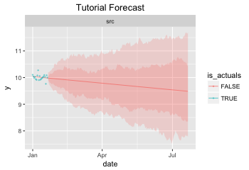

.. Adapt this file as required
   You may choose to add content directly here rather than using it as an index

.. _rst_tutorial:

********
Tutorial
********

Contents:

.. contents:: :local:

Getting Started
===============

To get started, install the library with pip ::

   pip install anticipy

It is straightforward to generate a forecast with the tool -
just call :py:func:`forecast.run_forecast(my_dataframe)`: ::

    import pandas as pd, numpy as np
    from anticipy import forecast, forecast_models, forecast_plot

    df = pd.DataFrame({'y': np.full(20,10.0)+np.random.normal(0.0, 0.1, 20),
                       'date':pd.date_range('2018-01-01', periods=20, freq='D')})
    df_forecast = forecast.run_forecast(df, extrapolate_years=0.5)
    print(df_forecast.tail(3))

Output::

    .         date source  is_actuals   model         y        q5       q20        q80        q95
    219 2018-07-19    src       False  linear  9.490259  7.796581  8.339835  10.556202  11.689470
    220 2018-07-20    src       False  linear  9.487518  7.828049  8.362620  10.466285  11.640854
    221 2018-07-21    src       False  linear  9.484776  7.776001  8.343068  10.423964  11.696145

The tool automatically selects the best model from a list of defaults - in this case, a simple linear model. Advanced
users can instead provide their preferred model or lists of candidate models, as explained in :ref:`models`.

You can plot the forecast output using the functions in :py:mod:`forecast_plot`.
:py:func:`anticipy.forecast_plot.plot_forecast` saves the plot as a file or
exports it to a jupyter notebook. The plot looks as follows:

The code to generate the plot is::

    path_tutorial_plot = 'plot-tutorial'
    # Save plot as a file
    forecast_plot.plot_forecast(df_forecast, output='html',
    path=path_tutorial_plot, width=350, height=240, title='Tutorial Forecast')
    # Show plot in a jupyter notebook
    forecast_plot.plot_forecast(df_forecast, output='jupyter', width=350,
    height=240, title='Tutorial Forecast')

Input Format
===============

The input time series needs to be formatted as a pandas series or dataframe. If a dataframe is passed, the following
columns are used:

  - **y:** float, values of the time series.
  - **date:** (optional) timestamp, date and time of each sample. If this column is not present, and the dataframe index is
    a DatetimeIndex, the index will be used instead. This is an optional column, only required when using models
    that are aware of the date, such as weekly seasonality models.
  - **x:** (optional) float or int, numeric index of each sample. If this column is not present, it will be inferred from the
    date column or, if that is not possible, the dataframe index will be used instead.
  - **source:** (optional) string, the name of the data source for this time series. You can include multiple time
    series in your input dataframe, using different source values to identify them.

If a series is passed, 'y' will be the series values and, if the index is a DateTimeIndex, it will be used as the 'date'
column. If the index is numeric, it will be used as the 'x' column instead.

An input dataframe should meet the following constraints:

  - Minimum required samples depends on number of parameters in the chosen models. run_forecast() will fail to fit if
    n_samples < n_parameters+2
  - y column may include null values.
  - Multiple values per sample may be included, e.g. when the same metric is observed by multiple sources. In that case,
    it is possible to assign weights to each individual sample so that one source will be given higher priority. To do
    that, include a 'weight' column of floats in the input dataframe.
  - A date column or date index is only required if the model is date-aware.
  - Non-default column names may be used. In that case, you need to pass the new column names to run_forecast() using
    the col_name\_ parameters.

Here is an example of using col_name\_ parameters to run a forecast witn non-default column names::

    df2 = pd.DataFrame({'my_y': np.full(20,10.0)+np.random.normal(0.0, 0.1, 20),
                       'my_date':pd.date_range('2018-01-01', periods=20, freq='D')})
    df_forecast2 = forecast.run_forecast(df2, extrapolate_years=0.5,
                                       col_name_y='my_y',
                                       col_name_date='my_date')

Detailed Output
===============

The library uses scipy.optimize to fit model functions to the input data. You can examine the model parameters, quality
metrics and other useful information with the argument simplify_output=False::

    dict_result = forecast.run_forecast(df, extrapolate_years=0.5,
                                        simplify_output=False, include_all_fits=True)
    # Table with actuals and forecast for best-fitting model, including prediction intervals
    print dict_result['forecast'].groupby('model').tail(1)
    # Table including time series actuals and forecast
    print dict_result['data'].groupby('model').tail(1)
    # Metadata table: model parameters and fitting output
    print dict_result['metadata']
    # Table with output data from scipy.optimize, for debugging purposes
    print dict_result['optimize_info']

Output - forecast table, same as output from run_forecast(simplify_output=True)::

    .         date source  is_actuals          model          y        q5        q20        q80        q95
    19  2018-01-20    src        True              y   9.928176       NaN        NaN        NaN        NaN
    221 2018-07-21    src       False  (linear+ramp)  10.838865  9.597208  10.121438  11.717812  12.551523

Output - data table. Has actuals and forecasts, including forecasts from non-optimal models if include_all_fits=True ::

    .         date                        model          y source                       source_long  is_actuals  is_weight  is_filtered  is_best_fit
    19  2018-01-20                       weight   1.000000    src  src:1-1:D:2018-01-01::2018-01-20        True       True        False        False
    39  2018-01-20                            y   9.928176    src  src:1-1:D:2018-01-01::2018-01-20        True      False        False        False
    241 2018-07-21                       linear   9.230972    src  src:1-1:D:2018-01-01::2018-01-20       False      False        False        False
    443 2018-07-21         (linear+season_wday)   9.283372    src  src:1-1:D:2018-01-01::2018-01-20       False      False        False        False
    645 2018-07-21                (linear+ramp)  10.838865    src  src:1-1:D:2018-01-01::2018-01-20       False      False        False         True
    847 2018-07-21  ((linear+ramp)+season_wday)  10.989835    src  src:1-1:D:2018-01-01::2018-01-20       False      False        False        False

Output - metadata table. Includes model parameters and model quality metrics such as cost and AICC::

    .  source                        model weights         actuals_x_range freq  is_fit      cost       aic_c                                         params_str status                       source_long                                             params  is_best_fit
    0    src                       linear     1-1  2018-01-01::2018-01-20    D    True  0.063076 -111.182993                                [-3.9e-03  1.0e+01]    FIT  src:1-1:D:2018-01-01::2018-01-20       [-0.0038931365581278176, 10.013491979601325]        False
    1    src         (linear+season_wday)     1-1  2018-01-01::2018-01-20    D    True  0.039519  -95.533948  [-3.3e-03  1.0e+01  1.0e-01 -1.4e-02  8.4e-02 ...    FIT  src:1-1:D:2018-01-01::2018-01-20  [-0.0032764198059819344, 9.975993454168774, 0....        False
    2    src                (linear+ramp)     1-1  2018-01-01::2018-01-20    D    True  0.045997 -111.498115                              [-0.  10.1  6.   0. ]    FIT  src:1-1:D:2018-01-01::2018-01-20  [-0.030005422538483477, 10.103677325164737, 6....         True
    3    src  ((linear+ramp)+season_wday)     1-1  2018-01-01::2018-01-20    D    True  0.020303  -93.853970  [-3.2e-02  1.0e+01  6.0e+00  3.8e-02  1.1e-01 ...    FIT  src:1-1:D:2018-01-01::2018-01-20  [-0.0318590092714045, 10.062880686158646, 6.00...        False

Output - optimize information table. Includes detailed data generated by scipy.optimize, useful for debugging::

    .  source                        model  success                                         params_str      cost    optimality  iterations  status  jac_evals                                     message                       source_long                                             params
    0    src                       linear     True                                [-3.9e-03  1.0e+01]  0.063076  1.213028e-09           4       1          4  `gtol` termination condition is satisfied.  src:1-1:D:2018-01-01::2018-01-20       [-0.0038931365581278176, 10.013491979601325]
    1    src         (linear+season_wday)     True  [-3.3e-03  1.0e+01  1.0e-01 -1.4e-02  8.4e-02 ...  0.039519  8.348877e-14           4       1          4  `gtol` termination condition is satisfied.  src:1-1:D:2018-01-01::2018-01-20  [-0.0032764198059819344, 9.975993454168774, 0....
    2    src                (linear+ramp)     True                              [-0.  10.1  6.   0. ]  0.045997  1.765921e-03          34       2         22  `ftol` termination condition is satisfied.  src:1-1:D:2018-01-01::2018-01-20  [-0.030005422538483477, 10.103677325164737, 6....
    3    src  ((linear+ramp)+season_wday)     True  [-3.2e-02  1.0e+01  6.0e+00  3.8e-02  1.1e-01 ...  0.020303  2.777755e-02          45       2         28  `ftol` termination condition is satisfied.  src:1-1:D:2018-01-01::2018-01-20  [-0.0318590092714045, 10.062880686158646, 6.00...

.. _models:

Forecast models
===============

By default, run_forecast() automatically generates a list of candidate models. However, you can specify a list of models
in the argument l_model_trend, so that the tool fits each model and chooses the best. Only the best fitting model will
be included in the output, unless you use the argument include_all_fits=True.
The following example runs a forecast with two models: linear and constant::

   dict_result = forecast.run_forecast(df, extrapolate_years=1, simplify_output=False,
                                      l_model_trend = [forecast_models.model_linear,
                                                       forecast_models.model_constant],
                                      include_all_fits=True)
   # Table including time series actuals and forecast
   print dict_result['data'].tail(6)
   # Metadata table: model parameters and fitting output
   print dict_result['metadata']

Output::

    .           date     model    y source                     source_long  is_actuals  is_weight  is_filtered  is_best_fit
    739 2018-12-31  constant  2.0    src  src:1:D:2018-01-01::2018-01-05       False      False        False        False
    740 2019-01-01  constant  2.0    src  src:1:D:2018-01-01::2018-01-05       False      False        False        False
    741 2019-01-02  constant  2.0    src  src:1:D:2018-01-01::2018-01-05       False      False        False        False
    742 2019-01-03  constant  2.0    src  src:1:D:2018-01-01::2018-01-05       False      False        False        False
    743 2019-01-04  constant  2.0    src  src:1:D:2018-01-01::2018-01-05       False      False        False        False
    744 2019-01-05  constant  2.0    src  src:1:D:2018-01-01::2018-01-05       False      False        False        False

::

    .  source     model weights         actuals_x_range freq  is_fit          cost       aic_c         params_str status                     source_long                         params  is_best_fit
    0    src    linear       1  2018-01-01::2018-01-05    D    True  6.162976e-33 -368.880931  [1.0e+00 1.1e-16]    FIT  src:1:D:2018-01-01::2018-01-05  [1.0, 1.1102230246251565e-16]         True
    1    src  constant       1  2018-01-01::2018-01-05    D    True  5.000000e+00    3.000000               [2.]    FIT  src:1:D:2018-01-01::2018-01-05                          [2.0]        False

You can configure run_forecast to fit a seasonality model in addition to the trend model. To do so, include the argument
l_model_season with a list of one or more seasonality models. If the list includes model_null, a non-seasonal model
will also be fit and compared with the seasonal models. The function tries all combinations of trend models and
seasonality models and selects the best::

    df=pd.DataFrame({'y': np.full(21, 10.)+np.tile(np.arange(0., 7),3)},
               index=pd.date_range('2018-01-01', periods=21, freq='D'))
    dict_result = forecast.run_forecast(df, extrapolate_years=0.5, simplify_output=False,
                                      l_model_trend = [forecast_models.model_linear,
                                                       forecast_models.model_constant],
                                       l_model_season = [forecast_models.model_null,        # no seasonality model
                                                       forecast_models.model_season_wday],  # weekday seasonality model
                                      include_all_fits=True)

    print dict_result['data'].tail(6)
    print dict_result['metadata'][['source','model','is_fit','cost','aic_c','params_str','is_best_fit']]

Output::

   .          date                        model     y source                     source_long  is_actuals  is_weight  is_filtered  is_best_fit
   2331 2019-01-16  (constant_mult_season_wday)  12.0    src  src:1:D:2018-01-01::2018-01-21       False      False        False        False
   2332 2019-01-17  (constant_mult_season_wday)  13.0    src  src:1:D:2018-01-01::2018-01-21       False      False        False        False
   2333 2019-01-18  (constant_mult_season_wday)  14.0    src  src:1:D:2018-01-01::2018-01-21       False      False        False        False
   2334 2019-01-19  (constant_mult_season_wday)  15.0    src  src:1:D:2018-01-01::2018-01-21       False      False        False        False
   2335 2019-01-20  (constant_mult_season_wday)  16.0    src  src:1:D:2018-01-01::2018-01-21       False      False        False        False
   2336 2019-01-21  (constant_mult_season_wday)  10.0    src  src:1:D:2018-01-01::2018-01-21       False      False        False        False

::

   . source                        model  is_fit          cost       aic_c                                         params_str  is_best_fit
   0    src                       linear    True  3.741818e+01   16.130320                                        [ 0.1 11.9]        False
   1    src     (linear_add_season_wday)    True  1.840127e-15 -742.442745  [3.5e-10 6.3e+00 3.7e+00 4.7e+00 5.7e+00 6.7e+...        False
   2    src                     constant    True  4.200000e+01   16.556091                                              [13.]        False
   3    src   (constant_add_season_wday)    True  1.686607e-15 -750.272181          [12.7 -2.7 -1.7 -0.7  0.3  1.3  2.3  3.3]        False
   4    src    (linear_mult_season_wday)    True  2.761458e-16 -782.272627  [-2.2e-10  1.9e+01  5.3e-01  5.9e-01  6.4e-01 ...         True
   5    src  (constant_mult_season_wday)    True  6.833738e-13 -624.181393          [15.9  0.6  0.7  0.8  0.8  0.9  0.9  1. ]        False

The following trend and seasonality models are currently supported. They are available as attributes from
:py:mod:`anticipy.forecast_models`:

.. csv-table:: Default forecast models
   :header: "name", "params", "formula","notes"
   :widths: 20, 10, 20, 40

   "model_null",0, "y=0", "Does nothing. Used to disable components (e.g. seasonality)"
   "model_linear",2, "y=Ax + B", "Linear model"
   "model_ramp",2, "y = (x-A)*B if x>A", "Ramp model"
   "model_season_wday",6, "see desc.",  "Weekday seasonality model. Assigns a constant value to each weekday"
   "model_season_fourier_yearly",20, "see desc", "Fourier yearly seasonality model"

.. csv-table:: Other forecast models
   :header: "name", "params", "formula","notes"
   :widths: 20, 10, 20, 40

   "model_constant",1, "y=A", "Constant model"
   "model_linear_nondec",2, "y=Ax + B", "Non decreasing linear model. With boundaries to ensure model slope >=0"
   "model_quasilinear",3, "y=A*(x^B) + C", "Quasilinear model"
   "model_exp",2, "y=A * B^x", "Exponential model"
   "model_step",2, "y=0 if x<A, y=B if x>=A", "Step model"
   "model_two_steps",4, "see model_step", "2 step models. Parameter initialization is aware of # of steps."
   "model_sigmoid_step",3, "y = A + (B - A) / (1 + np.exp(- D * (x - C)))", "Sigmoid step model"
   "model_sigmoid",3, "y = A + (B - A) / (1 + np.exp(- D * (x - C)))", "Sigmoid model"
   "model_season_wday_2",2, "see desc.", "Weekend seasonality model. Assigns a constant to each of weekday/weekend"
   "model_season_month",11, "see desc.", "Month seasonality model. Assigns a constant value to each month"

If the available range of models isn't a good match for your data, it is also possible to define new models
using :py:class:`anticipy.forecast_models.ForecastModel`

Models with dummy variables
===========================

You can use :py:func:`anticipy.forecast_models.get_model_dummy` to get a model based on a dummy variable. This
model returns a constant value when the dummy variable is 1, and 0 otherwise::

    # Example dummy model - check if date matches specific dates in list
    model_dummy_l_date = forecast_models.get_model_dummy('dummy_l_date', ['2017-12-22', '2017-12-27'])

    # Example dummy model - checks if it is Christmas
    model_dummy_christmas = forecast_models.get_model_dummy('dummy_christmas',
                                            lambda a_x, a_date: ((a_date.month == 12) & (a_date.day == 25)).astype(float))

    a_x = np.arange(0,10)
    a_date = pd.date_range('2017-12-21','2017-12-30')
    params = np.array([10.]) # A=10

    print model_dummy_l_date(a_x, a_date, params)
    print model_dummy_christmas(a_x, a_date, params)

Output::

    [ 0. 10.  0.  0.  0.  0. 10.  0.  0.  0.]
    [ 0.  0.  0.  0. 10.  0.  0.  0.  0.  0.]

Dummy variables can be very useful when used in composition with simpler models. A common application is to check
for bank holidays or other special dates. The following example uses a dummy variable to improve fit
in a linear time series with a spike on Christmas::

    df=pd.DataFrame({'y': 100+np.arange(0,6)+np.array([0.,0.,0.,0.,50.,0.,])},
               index=pd.date_range('2017-12-21','2017-12-26'))

    # Example dummy model - checks if it is Christmas
    model_dummy_christmas = forecast_models.get_model_dummy('dummy_christmas',
                                            lambda a_x, a_date: ((a_date.month == 12) & (a_date.day == 25)).astype(float))

    dict_result = forecast.run_forecast(df, extrapolate_years=1, simplify_output=False,
                                      l_model_trend = [forecast_models.model_linear,
                                                       forecast_models.model_linear+model_dummy_christmas],
                                      include_all_fits=True)

    print dict_result['metadata'][['source','model','is_fit','cost','aic_c','params_str','is_best_fit']]

Output::

    . source                         model  is_fit          cost       aic_c        params_str  is_best_fit
    0    src                        linear    True  8.809524e+02   37.935465       [ 5.3 97.6]        False
    1    src  (linear_add_dummy_christmas)    True  9.980807e-20 -255.256784  [  1. 100.  50.]         True

Outlier Detection
=================

If you call :py:func:`anticipy.forecast.run_forecast` and specify as input `find_outliers=True`,
it will try to automatically identify any outliers exist in the input Series. The weight for these samples is
set to 0, so that they are ignored by the forecast logic.

Example::

   a_y = [19.8, 19.9, 20.0, 20.1, 20.2, 20.3, 20.4, 20.5,
          20.6, 10., 20.7, 20.8, 20.9, 21.0,
          21.1, 21.2, 21.3, 21.4, 21.5]
   a_date = pd.date_range(start='2018-01-01', periods=len(a_y), freq='D')
   df_spike = pd.DataFrame({'y': a_y})

   dict_result = forecast.run_forecast(df_spike, find_outliers=True,
                                       simplify_output=False, include_all_fits=True,
                                       season_add_mult='add')
   df_data = dict_result['data']
   # Subset of output - shows that the sample with a spike now has weight=0, and is ignored by forecast
   df_weighted_actuals = df_data.loc[df_data.model=='actuals'][['y','weight']]

Output::

   .      y  weight
   0   19.8     1.0
   1   19.9     1.0
   2   20.0     1.0
   3   20.1     1.0
   4   20.2     1.0
   5   20.3     1.0
   6   20.4     1.0
   7   20.5     1.0
   8   20.6     1.0
   9   10.0     0.0
   10  20.7     1.0
   11  20.8     1.0
   12  20.9     1.0
   13  21.0     1.0
   14  21.1     1.0
   15  21.2     1.0
   16  21.3     1.0
   17  21.4     1.0
   18  21.5     1.0

